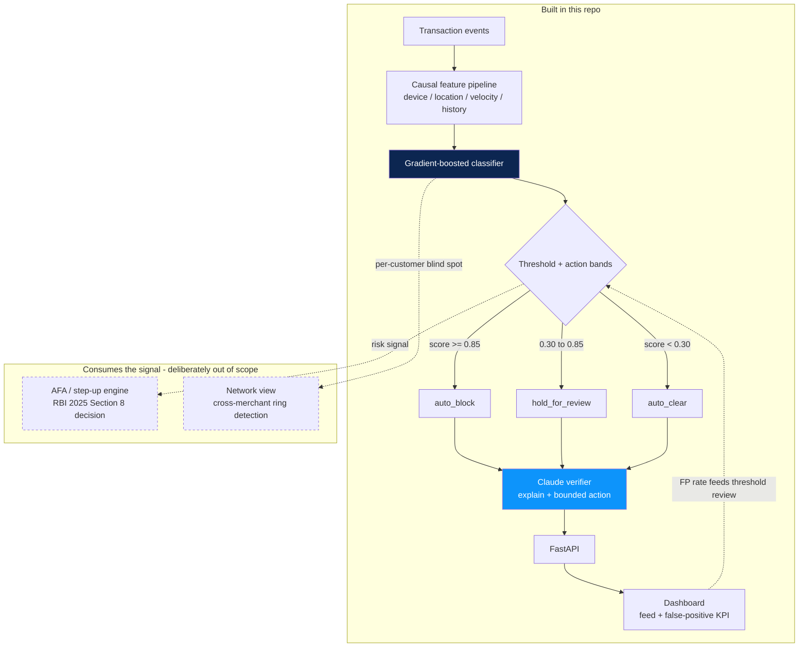

# Fraud Risk Detector + LLM Verifier

**Razorpay AI Builder Buildathon — Track 02: AI Risk Manager**

A gradient-boosted classifier scores every payment transaction for fraud risk. Every
flagged transaction is then passed to Claude, which explains the flag in plain language
and recommends one **bounded** action: `auto_block`, `hold_for_review`, or `auto_clear`.

The point of the second stage is that a fraud score is not an explanation. A risk analyst
staring at `0.94` cannot tell a card-testing burst from a customer who bought a laptop
while on holiday — and the difference decides whether you block a good customer. The
verifier turns the model's signals into something a human can act on or overrule.

---

## The problem

Fraud detection has an asymmetric cost function. A missed fraud costs the chargeback; a
false positive costs a legitimate customer, who often does not come back. At a 0.76%
fraud base rate, a model that flags 1% of traffic is touching thousands of good payments
a day. So the interesting question is not "what's the F1" — it's **what happens to the
transactions in the middle**, where the model is unsure.

This project routes that middle band to an LLM reviewer instead of forcing a binary call.

## Architecture



Two boundaries in that diagram are load-bearing.

**The verifier is fenced in.** It receives the transaction, its behavioural features, the
model's probability, and **the action band that score falls into**. It may escalate caution
(recommend `hold_for_review` where the band allows `auto_clear`) but it cannot recommend a
less cautious action than the classifier's score permits. The LLM explains and advises; it
does not get to overrule the model downward.

**This system scores risk; it does not authenticate.** The dashed boxes are things that
would consume this signal, not things built here — see the next section for why that
distinction matters legally, and the limitations section for what the network blind spot
actually costs.

| Path | What |
|---|---|
| `ml/generate_data.py` | Synthetic payment generator — 4 fraud archetypes + legit-suspicious traffic |
| `ml/features.py` | Causal feature engineering, shared by training and inference |
| `ml/test_features.py` | Leak test: asserts prefix-computed features equal full-frame features |
| `ml/train.py` | Temporal split, training, honest evaluation |
| `backend/main.py` | FastAPI: scored feed + Claude verifier |
| `frontend/` | React + Tailwind dashboard |

## Why this matters for Razorpay

Four reasons the specific engineering choices here map onto real gaps, rather than being
generic ML hygiene.

### 1. Risk-based authentication now has a deadline — and it names these exact features

The [RBI (Authentication Mechanisms for Digital Payment Transactions) Directions, 2025](https://www.rbi.org.in/Scripts/NotificationUser.aspx?Id=12898&Mode=0)
(circular RBI/2025-26/79, issued 25 September 2025) take effect **1 April 2026** for all
payment system providers and participants, with a further deadline of 1 October 2026 for
validating non-recurring cross-border card-not-present transactions. They require at least
two authentication factors, one of which must be dynamic.

**Be precise about what this directive does and does not govern: it regulates
*authentication*, not fraud scoring.** Nothing in it obliges anyone to run a fraud model,
and nothing in this repo is a compliance claim. What it does is make *risk-based*
authentication explicitly permissible — Section 8 allows issuers to

> "identify transactions for evaluation against behavioural / contextual parameters such as
> transaction location, user behaviour patterns, device attributes, historical transaction
> profile, etc."

That clause names four categories, and they are almost exactly this feature set:
transaction location (`ip_country`, `ip_billing_mismatch`), user behaviour patterns
(`txns_1h`, `txns_24h`, `distinct_merchants_24h`), device attributes (`is_new_device`,
`devices_seen_prior`), and historical transaction profile (`amount_vs_trailing_mean`,
`customer_age_days`). A routine payment from a known device clears with minimal friction;
an unfamiliar device-plus-location combination is what pushes the score into a higher band.

**This is where the causal-features fix stops being academic.** A step-up decision is made
*at authorization time*, with only the past available. A velocity feature computed with a
whole-dataset `groupby` is not merely optimistic on paper — it is unimplementable, because
the data it depends on does not exist yet when the decision must be made. The leak test is
what makes these features deployable rather than just accurate in a notebook.

The graded output is the other half: a step-up decision needs a *scored* signal, not a
binary flag, which is why the three bands exist rather than one accept/reject line. (The
threshold behind them is currently F1-optimal, not cost-weighted — see limitation 6, which
is the single highest-value change left in this repo.) **This system supplies the risk
signal that a compliant AFA engine would consume — it is not itself an AFA
implementation.**

### 2. UPI is a push rail, so there is no chargeback to fall back on

UPI carried [83.4% of India's digital payment ecosystem volume in FY25](https://www.business-standard.com/finance/news/upi-s-contribution-to-payments-ecosystem-volume-grows-to-83-4-in-fy25-125052900871_1.html),
rising to [85.5% in H2 2025](https://www.ibef.org/news/upi-accounted-for-85-5-of-digital-transaction-volume-in-h2-2025-rbi-report).
It is a *push* mechanism: the customer sends funds, and there is no card-network chargeback
rail to reverse them. Recovery means freezing the beneficiary account before the money is
cashed out — a race measured in minutes.

This changes what detection is worth. Catching card fraud at T+1 produces a chargeback;
catching UPI fraud at T+1 often produces nothing but a write-off. **Post-hoc detection is worth
dramatically less than pre-authorization scoring on this rail**, which is why the model
scores from strictly-prior features before authorization, and why `auto_block` exists as a
distinct action rather than routing everything to human review. Review latency is only
affordable on the middle band — on the top band the money is already gone by the time an
analyst opens the queue.

### 3. False-positive rate is a business KPI, not an accuracy footnote

Razorpay's own framing on the [Vulcan launch](https://www.dqindia.com/news/razorpay-vulcan-8x-fraud-detection-baseline-12398348)
is instructive: the headline is 5× more fraudulent or disputed transactions identified
**without increasing the number of alerts**. Holding alert volume constant *is* the
false-positive framing — it is the constraint the capability gain is measured against.

So the dashboard puts **good traffic held (0.17%)** next to precision and recall as a
first-class number, and the README publishes the full threshold curve instead of one
flattering F1. At a 0.76% base rate and Razorpay's volumes, 0.17% of good traffic is a
large absolute count of real customers being made to wait.

This is also why the first trained model was rejected rather than shipped. It scored
P 0.986 / R 0.953 with 2 false positives in 14,000 — which was a data artifact, not a
result, and which would have left the `hold_for_review` band decorative. A fraud system
with no false positives has no review queue, and a review queue is the thing the LLM
verifier exists to serve.

### 4. Cross-merchant rings are the real gap, and this design cannot see them

Every velocity feature here is **per customer, at one merchant**. A fraud ring that hits
200 unrelated merchants once each looks like 200 unremarkable first-time transactions —
`txns_1h` is 0 for all of them. The blind spot is structural, not a tuning problem.

This is precisely the gap [Vulcan](https://press.aboutamazon.com/aws-international/2026/8/razorpay-launches-vulcan-indias-first-ai-payments-foundation-model-fueled-by-nvidia-and-aws-re-architecting-payments-for-a-350-bn-e-comm-future-by-2030)
is built to close: trained across Razorpay's entire network rather than on any single
merchant's data, it can identify a compromised card the moment it surfaces at multiple
unrelated merchants — before any individual seller has enough data to flag the pattern.

The honest positioning is that these are complementary layers, not competitors.
Single-transaction scoring with a human-readable explanation is the merchant-side layer;
network-view ring detection sits above it and sees what no single merchant can. This repo
builds the former and is explicit about not attempting the latter.

## Data

**A purpose-built synthetic generator, not IEEE-CIS or the ULB credit-card set.**

Both of those public datasets ship their signal as PCA components (`V1…V339`) — the
meaning was destroyed before you could download it. A classifier trains on them fine, but
the LLM verifier would be asked to explain `V257 = 3.2`, which is not explainable. Since
explanation is the headline feature here, anonymised features break the product by
construction. A generator also keeps the domain right (UPI / card / netbanking / wallet)
and makes the repo reproducible from one command with no Kaggle auth.

72,452 transactions over 180 days, 8,000 customers, **0.76% fraud**.

Four fraud archetypes, all with deliberate overlap into legitimate behaviour:

| Archetype | Signature |
|---|---|
| Card testing | Rapid low-value probes across many merchants, fresh device, declines |
| Account takeover | Known customer, new device + new geography, escalating amounts |
| Stolen card | New-ish account, high value, country mismatch |
| Slow drain | Victim's own device and geography, ordinary amounts — intentionally hard |

Roughly 30% of fraud episodes are "careful" — the fraudster proxies through the victim's
own country and device — so geography and device mismatch are useful signals but never
giveaways. The generator also emits **legitimate traffic engineered to look like fraud**:
travellers, phone upgrades, genuine big-ticket purchases, and a combined
new-device-plus-abroad-plus-large-amount pattern that is indistinguishable from account
takeover on the available features. Those are the false positives, and they are supposed
to be there — without them the review queue is empty and precision is fiction.

Finally, 8% of fraud is scrubbed of every tell, so recall has a real ceiling.

### Features

Stateless: log amount, hour, day of week, night flag, payment method, merchant category,
email-domain class, IP country, IP/billing mismatch, account age, new-account flag,
failed attempts.

Behavioural (per customer, computed causally): transactions in the last 1h and 24h,
distinct merchants in 24h, amount vs. the customer's trailing mean, first-sighting-of-device
flag, distinct devices seen before, minutes since previous transaction.

### Split strategy and leakage

**Temporal split — 70% train / 10% validation / 20% test, cut on time, not on rows.** Fraud
tactics drift, and a random split lets the model learn from transactions that had not
happened yet. Returning customers do appear on both sides, which mirrors production:
you score tomorrow's traffic with today's model.

**The real leakage risk was never the split — it was the aggregates.** Velocity features
computed with a whole-dataset `groupby` embed the future into every row and are the
standard way fraud pipelines inflate their own scores. Every behavioural feature here is
computed from strictly prior transactions (`rolling(..., closed="left")`), through the same
code path at training and inference time.

`ml/test_features.py` enforces this: it computes features on every prefix of a frame and
asserts they equal the full-frame values for those rows. If a later transaction can change
an earlier row's features, the test fails. **It caught a real bug** —
`groupby(...).rolling(...)` returns rows in *group* order, not original row order, so
assigning the result back onto a time-sorted frame was silently scrambling velocity
features across customers.

The threshold is tuned on validation. The test set is scored exactly once, at the end.

## Model card

`HistGradientBoostingClassifier` (scikit-learn), 300 iterations, learning rate 0.06,
`class_weight="balanced"`, native categorical support. Chosen over XGBoost because sklearn
handles the categoricals natively and adds no dependency; the gap on tabular data this
size is not meaningful.

**Held-out test set: 14,491 transactions, 110 fraudulent (0.76% base rate).**
Threshold 0.463, selected on validation.

| Metric | Value |
|---|---|
| Precision | **0.769** |
| Recall | **0.727** |
| F1 | **0.748** |
| PR-AUC | **0.789** |
| ROC-AUC | 0.976 |

Confusion matrix:

|  | Predicted legit | Predicted fraud |
|---|---|---|
| **Actually legit** | 14,357 | 24 |
| **Actually fraud** | 30 | 80 |

### The false-positive tradeoff, stated plainly

24 false positives against 14,381 legitimate transactions — **0.17% of good traffic held**.
30 frauds missed. Neither number is free, and the threshold is the dial between them:

| Threshold | Precision | Recall | F1 |
|---|---|---|---|
| 0.0003 | 0.070 | 0.927 | 0.131 |
| 0.0096 | 0.317 | 0.836 | 0.460 |
| 0.077 | 0.579 | 0.764 | 0.659 |
| **0.463** (chosen) | **0.769** | **0.727** | **0.748** |
| 0.950 | 0.959 | 0.636 | 0.765 |
| 1.000 | 1.000 | 0.136 | 0.240 |

Catching 93% of fraud means holding roughly one in fourteen good payments. That is the
whole argument for the `hold_for_review` band: the middle of this curve is where an LLM
reviewer earns its cost, because a binary threshold has to be wrong in one direction.

Note that **ROC-AUC (0.976) flatters the model** relative to PR-AUC (0.789). At a 0.76%
base rate, ROC-AUC is the wrong headline metric — PR-AUC is the honest one.

### Honest limitations

Ordered by how much they'd matter in production, not by how easy they are to admit.

1. **The data is synthetic.** The model partly learns patterns I planted, so these numbers
   are optimistic versus real payment traffic. The mitigations above (overlapping
   distributions, careful fraudsters, unlearnable fraud, look-alike legitimate traffic)
   make it a fair test of the *pipeline*, not a prediction of production performance.
2. **No cross-merchant view — the ring blind spot from section 4.** Every velocity feature
   is scoped to one customer at one merchant, so a ring spreading thin across many
   merchants is invisible by construction. This is an architectural boundary, not a bug:
   closing it requires network-level data this repo does not have.
3. **No beneficiary-side signals, which is where UPI fraud actually lives.** The generator
   models the payer side only. Real UPI fraud detection leans heavily on the *recipient*:
   mule-account age, beneficiary inflow velocity, first-time-payee patterns, and the
   freeze-window race after a report. None of that is modelled here, so the UPI framing in
   section 2 is an argument about design priorities, not a demonstration of UPI-specific
   detection.
4. **Not an AFA implementation.** This produces a risk score. It performs no
   authentication, implements no second factor, and makes no compliance claim under
   RBI/2025-26/79. The value proposition is that it produces the *kind* of graded,
   causally-computed signal Section 8 contemplates — the step-up engine itself is absent.
5. **Validation F1 was 0.857, test F1 is 0.748.** That drop is genuine temporal drift and
   is exactly what a time-based split is supposed to expose. A random split would have
   hidden it.
6. **The threshold is F1-optimal, not cost-optimal.** Maximising F1 implicitly assumes a
   false positive and a missed fraud cost the same amount. They do not — and on a push rail
   with no chargeback, the asymmetry is severe and runs in a different direction than it
   does on cards. A production threshold should minimise expected cost using real
   per-outcome figures, which would move the operating point off 0.463. Everything needed
   to do this is already in `models/metrics.json`; it needs the business's actual numbers,
   which is why it is flagged rather than guessed.
7. **The verifier is not evaluated.** Explanation quality is assessed by reading it, not
   by a metric. A proper eval would need labelled analyst judgements.
8. **Feature attribution is implicit.** The verifier reasons over feature values rather
   than SHAP values, so its "key signals" are plausible rather than provably the model's
   actual drivers. SHAP would close that gap — and it matters more than it looks, because
   an explanation shown to an analyst that is *not* the model's real reason is worse than
   no explanation.
9. **No calibration.** Scores are usable for ranking and banding; they are not calibrated
   probabilities, so the band edges (0.30 / 0.85) are operating points rather than
   statements about likelihood.

## Running it

Requires Python 3.11+ and Node 18+.

```bash
pip install -r requirements.txt
```

Generate the data, verify causality, train, and print the evaluation:

```bash
python ml/generate_data.py && python ml/test_features.py && python ml/train.py
```

Add your Anthropic key — without it the API and dashboard still run, but `/verify`
returns a clear 503 instead of an explanation:

```bash
cp .env.example .env
```

Backend:

```bash
python -m uvicorn backend.main:app --port 8000
```

Frontend, in a second terminal:

```bash
npm install --prefix frontend && npm run dev --prefix frontend
```

Open http://localhost:5173.

### API

| Endpoint | Purpose |
|---|---|
| `GET /transactions?limit=&flagged_only=` | Scored feed, replayed from the held-out test set |
| `POST /verify/{txn_id}` | Claude explanation + bounded action (cached per transaction) |
| `GET /metrics` | Evaluation results behind the dashboard model card |

The feed is the **test set**, not a random sample — every score shown is a genuine
out-of-sample prediction.

## Notes

`data/` and `models/*.joblib` are gitignored and regenerate from the commands above;
`models/metrics.json` is versioned so evaluation results stay reviewable in the diff.
Real keys stay in `.env`, which is gitignored — `.env.example` is the template.
